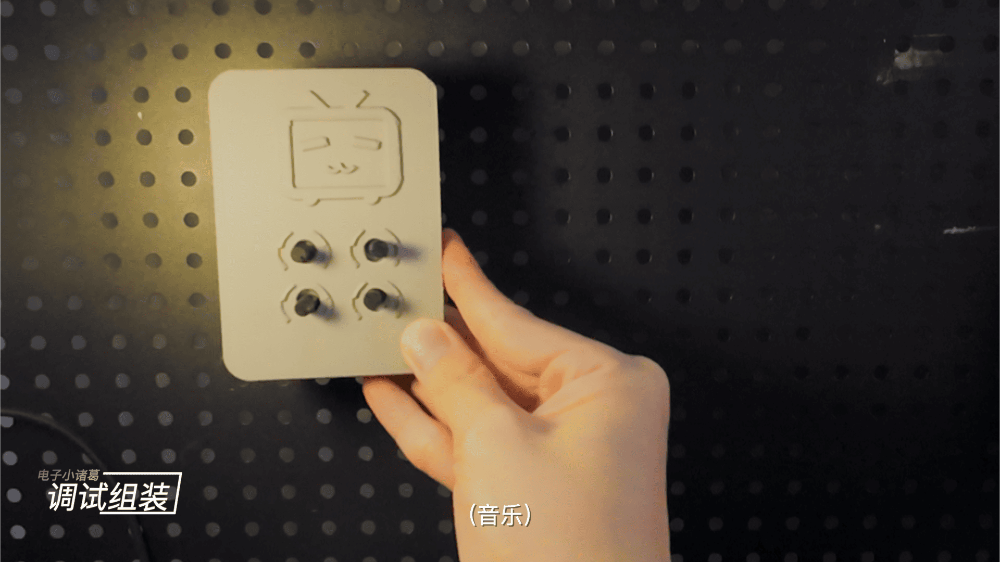
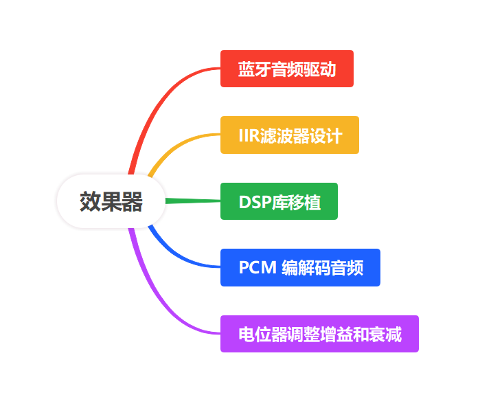

 **视频链接： [点此直达 视频观影](https://www.bilibili.com/video/你的BV号)**

## 项目简介
本项目实现了一个基于蓝牙音频传输的音乐均衡器，用户可以通过手机/电脑蓝牙发送音频信号到设备，设备对音频信号进行实时处理，并输出到耳或音箱。
系统支持多段均衡调节，允许用户对不同频段进行增益控制，以实现个性化的音效体验。

## 系统功能

* 蓝牙接入：支持 A2DP 蓝牙音频协议，可与手机/电脑连接。

* 音频处理：内置数字滤波器，支持 4 段均衡调节（如低频、中低频、中高频、高频）。

* 增益控制：通过电位器调节各频段增益。

* 输出接口：3.5mm 音频接口，支持有源音箱/耳机。

* DIY可扩展：硬件电路与算法可根据需求扩展更多频段或加入混响、音效模块。     

## 系统架构

设计思路主要由下面几个部分组成：

 

## 参考链接
1. [稚晖君设计框架](https://github.com/peng-zhihui)
2. [ARM-DSP](https://github.com/ARM-software/CMSIS-DSP)
3. [蓝牙DAP](https://github.com/tierneytim/btAudio)